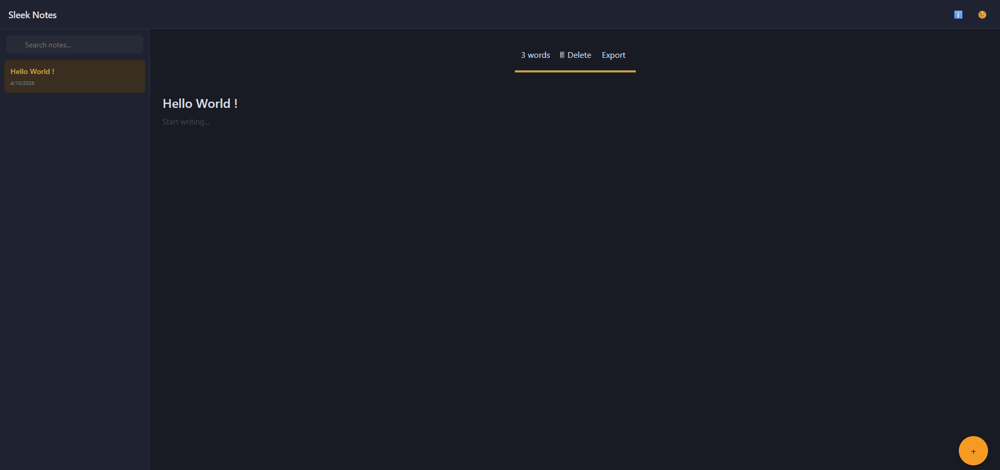

<!-- Sleek Notes README -->

<h1 align="center">📝 Sleek Notes</h1>
<h3 align="center">🚀 AI Powered Notepad Web App</h3>

  A modern, lightweight and smart note-taking application with AI features to boost productivity.

  
  
  

---

## ✨ Features

<ul>
  <li>📝 Create, edit, and delete notes</li>
  <li>🔍 Real-time search functionality</li>
  <li>📌 Pin important notes</li>
  <li>🕒 Note history tracking</li>
  <li>🌙 Dark / Light mode toggle</li>
  <li>💾 Local storage support</li>
  <li>🤖 <b>AI-powered assistance</b> for smarter note-taking</li>
</ul>

---

## 🤖 AI Capabilities

Sleek Notes integrates AI to enhance user productivity:

<ul>
  <li>✨ Smart content suggestions</li>
  <li>✨ Improved writing assistance</li>
  <li>✨ Faster and efficient note creation</li>
</ul>

---

## 🛠️ Tech Stack

  

---

## 📸 Screenshots

  

---

## 🚀 Getting Started

<pre>
git clone https://github.com/soniji3/Notepads.git
cd Notepads
open index.html
</pre>

---

## 📌 Future Improvements

<ul>
  <li>🔐 User authentication</li>
  <li>☁️ Cloud sync</li>
  <li>📱 Mobile app version</li>
  <li>🧠 Advanced AI features</li>
</ul>

---

## 👨‍💻 Author

<b>Lakshya Soni</b> 
💼 Aspiring Software Developer 
🌐 Passionate about building impactful projects

---

## ⭐ Support

If you like this project: 
⭐ Star this repo 
📢 Share feedback 
🤝 Connect on LinkedIn

---

## 📃 License

This project is open-source and available under the MIT License.

